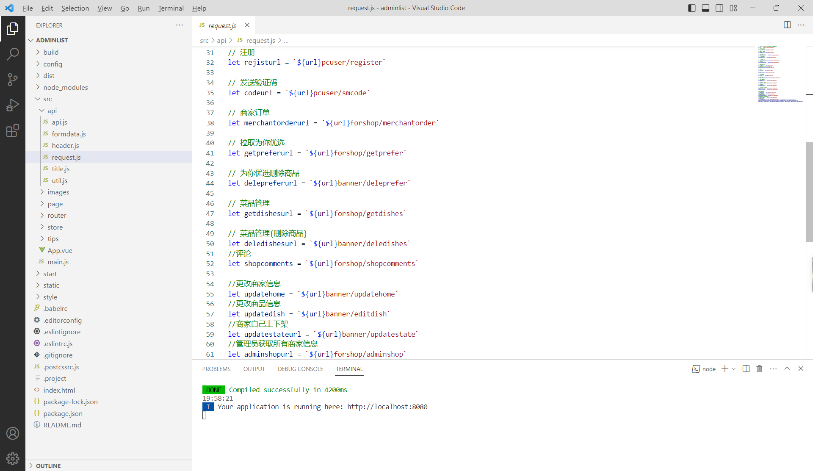
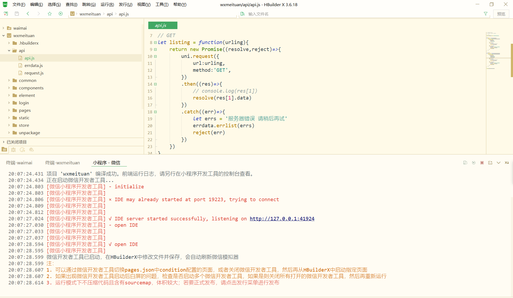
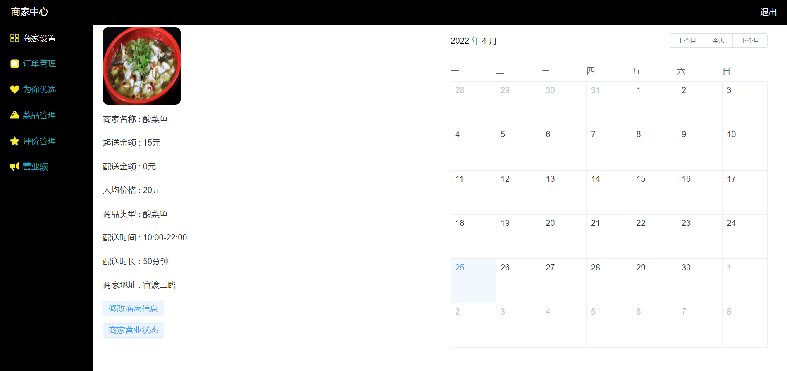
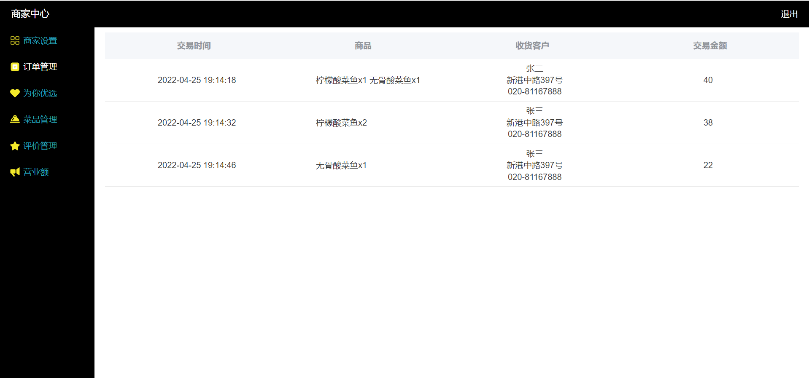
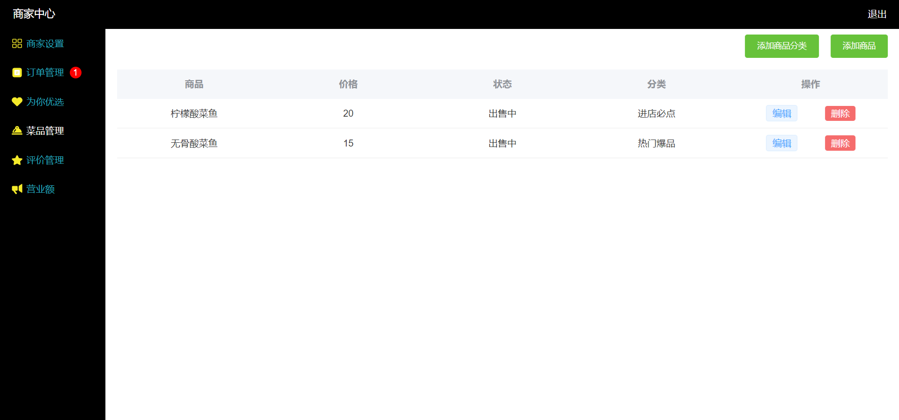
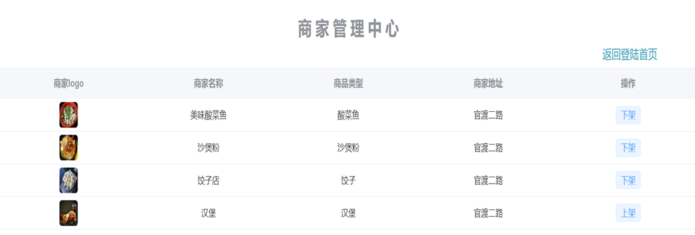
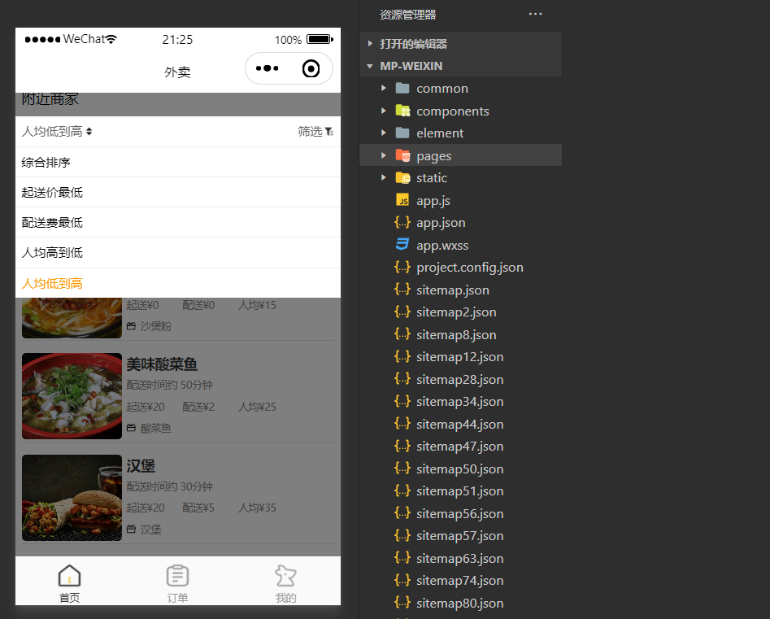
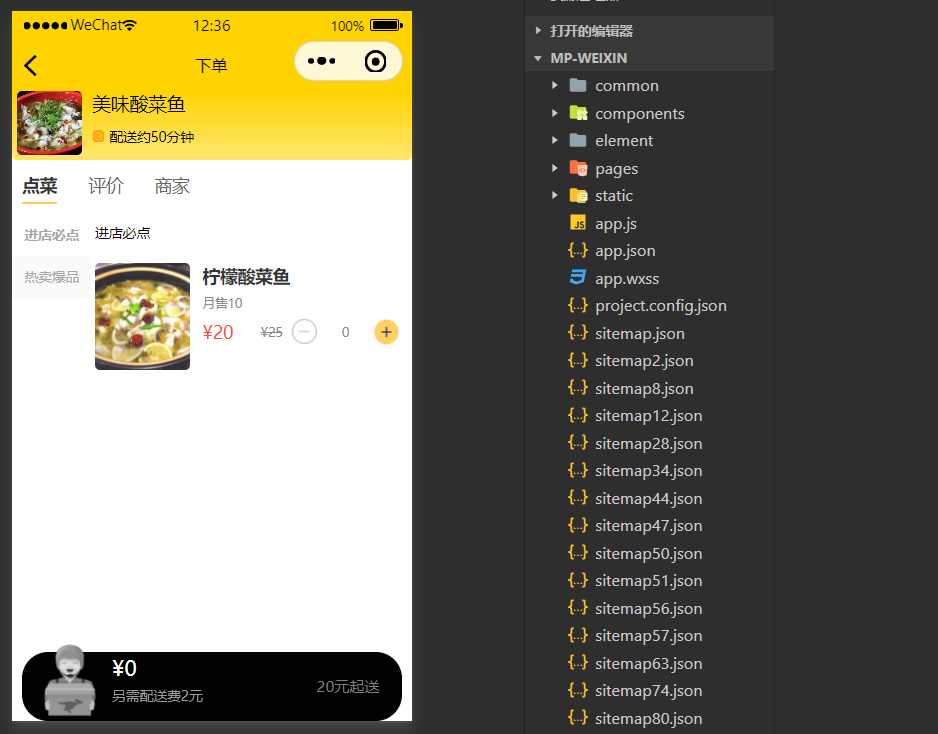
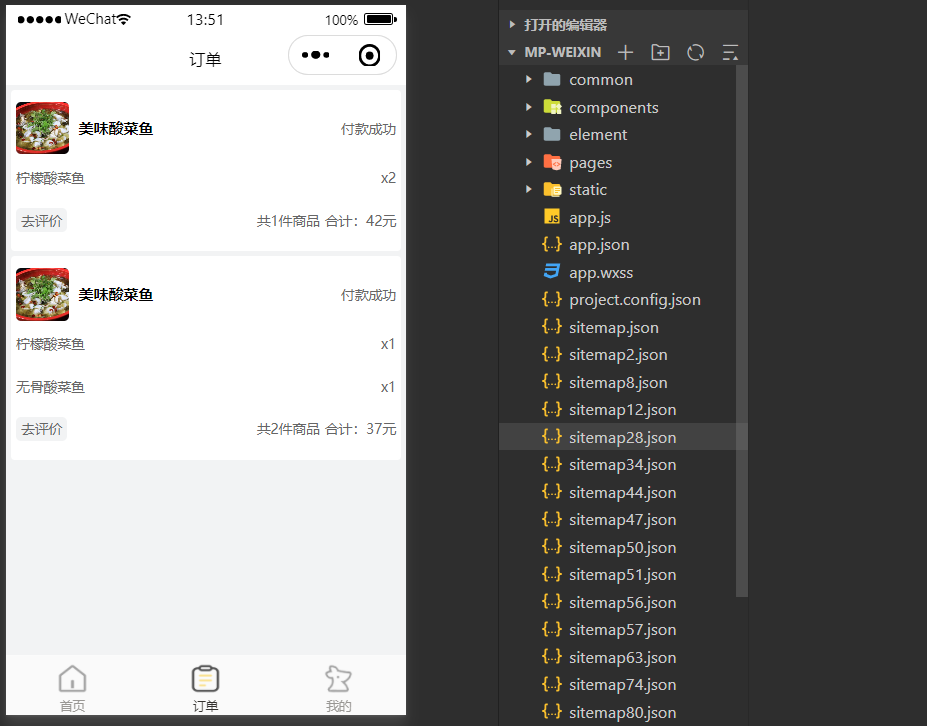

# 小程序多商家外卖系统

### 有问题，或者需要协助调试运行项目的, 可以+扣扣：2529519551，或者+ wx ：xzxj0206  注明项目，“git+项目名称” ，如：“git学生宿舍管理系统”

## 运行界面

## 介绍
基于微信小程序的多商家外卖平台

这是个小程序的多商家外卖系统
本系统后端基于Koa框架技术、前端Vue框架技术

后台：实现商家登录注册、商家设置、菜品管理、为你优选、订单管理、营业额统计、评价管理、管理员上下架商户
小程序：实现用户自动登录、搜索、商家筛选、查看评价、点餐下单与支付、查看订单以及订单评价
使用的技术有阿里云MongoDB、阿里云OSS镜像存储、阿里云短信服务

## 部分页面展示

